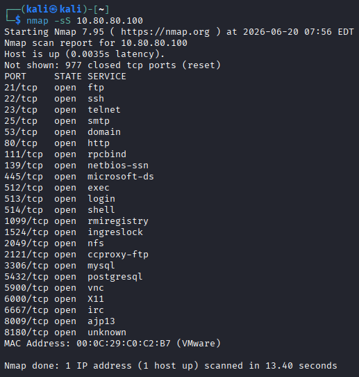
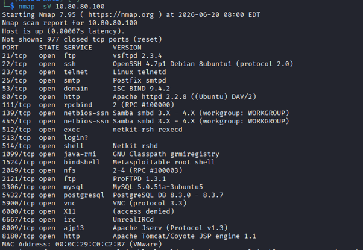
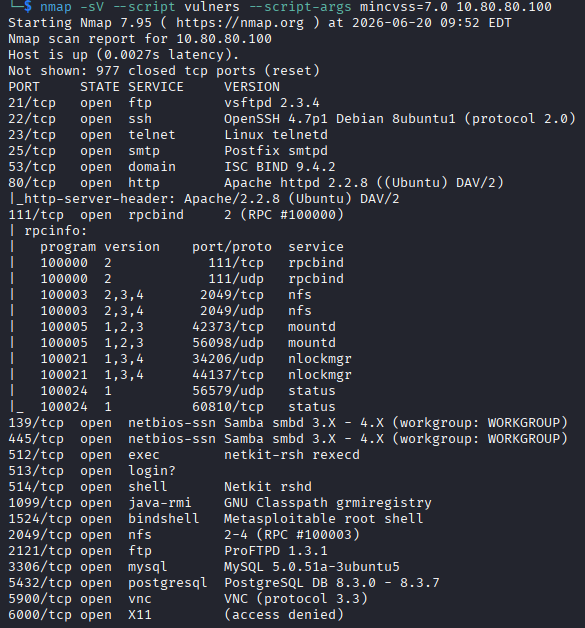

Metasploitable 2 Vulnerability Assessment
Overview
This project documents a vulnerability assessment using Nmap on Metasploitable 2.

Tools Used
 Kali Linux
 Nmap
 Metasploitable 2
EVIDENCE
Nmap Scan

 Key Findings
 VSFTPD Backdoor (High)
 Samba Vulnerabilities (High)
EVIDENCE

Author
Innocent Ezekiel Ilo
